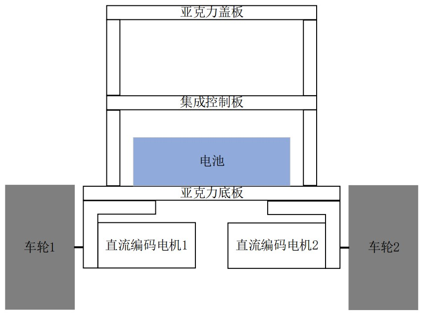
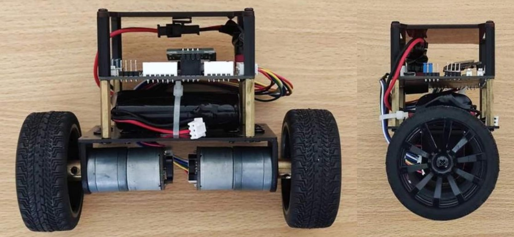
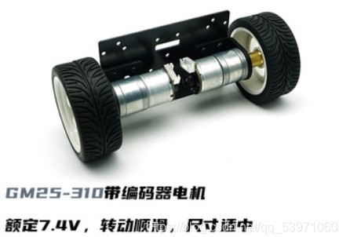
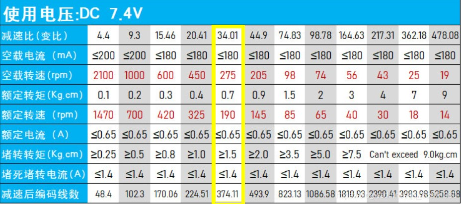
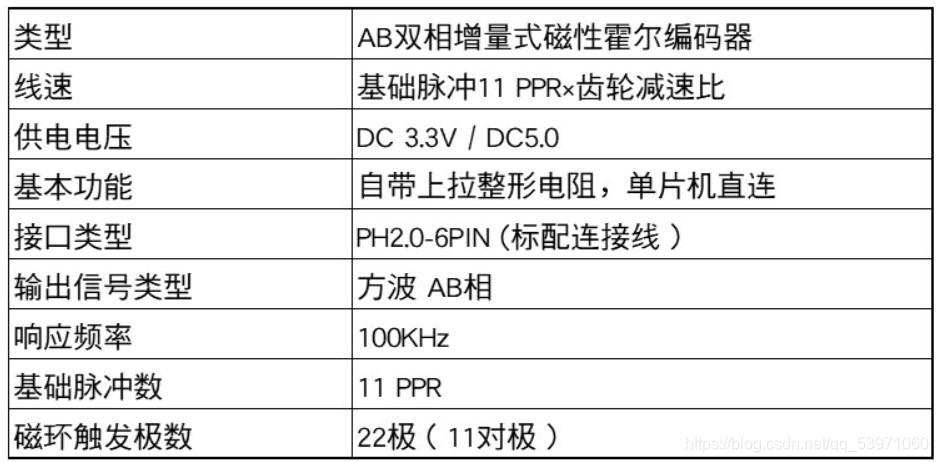
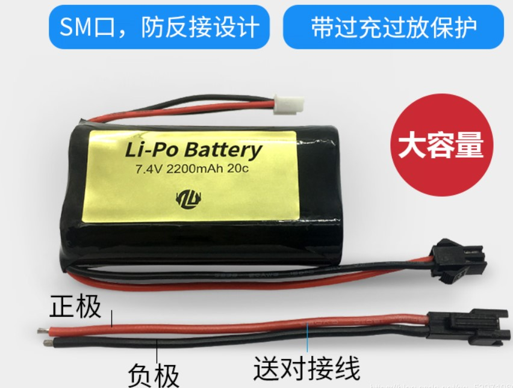
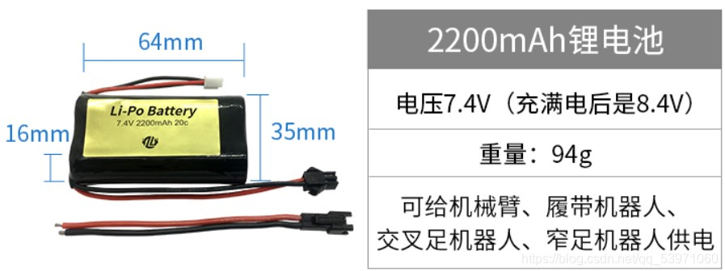
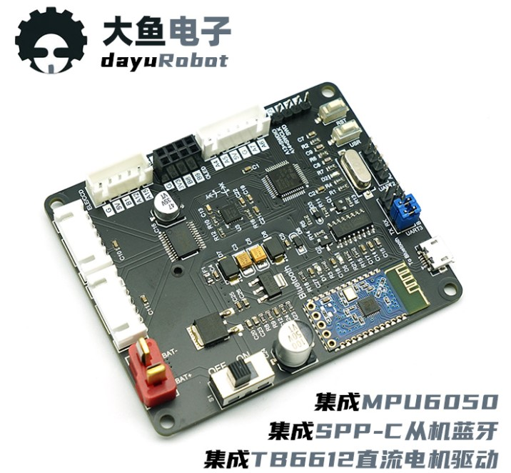
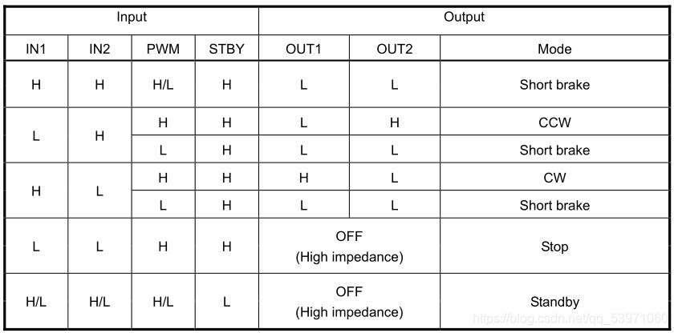

# 双轮平衡小车控制系统设计

## 硬件部分
### 机械结构
  小车以一块长为124mm，宽为 66mm 的亚克力板作为底板。在底板下方使用一对 L 形的铝合金支架将两台直流编码电机固定，且每个电机轴上都连接有直径为 65mm 的车轮，两个轮子平行且共轴。在紧贴着底板的上方固定一块锂电池，它是整个系统的能量来源。同时，用 4 根60mm 长的铜柱将集成控制板架起，该控制板上集成了控制系统所有的电路模块。然后上方再搭一块亚克力盖板，起到保护控制板的作用。由于小车在实验时，电机可能会出现高频振动的现象，为了减小振动对集成控制板上姿态传感器的影响，电池和控制板不能紧贴着，必须留有一定的间隙，以避免高频振动经电池传导到姿态传感器。

按照以上描述所设计的机械结构搭建出平衡小车系统的实物：

### 硬件详情
**1.小车底盘**

电机为直流减速电机（有刷），额定电压7.4V，减速比1：34。电机详细参数如下：

编码器参数如下：

**2.电池**

[锂电池参数释义及注意事项](https://blog.csdn.net/xiaogu0322/article/details/107993225?spm=1001.2014.3001.5506)

**3.主控板**

主控板购买的大鱼电子的stm32f103c8t6平衡小车主控板B2

其中集成的TB6612直流电机驱动具有如下特性：
 - 电源电压：VM = 15 V（最大）
 - 输出电流：iout = 1.2A（平均值）/ 3.2A（峰值）
 - 输出低导通电阻:0.5ω
 - 待机(省电)系统
 - 正转/反转/短制动/停止功能模式
 - 内置热关断电路和低压检测电路

控制功能真值表如下：

## 软件部分
### 1.电池电量显示
通过控制LED的亮度（通过PWM）提示电池当前的电量，具体如下：

|电池电压|LED亮度|
|--|--|
|>7.9V | 100% |
| 7.4~7.9V| 75% |
| 7~7.4V| 50% |
| 6.5~7V| 20% |
| <=6.5V| 熄灭 |

当LED熄灭时，提示用户应及时给电池充电。
由于本工程采用的控制板上LED1是连接到PC14来控制的，而PC14并不是某个TIM的通道，所以无法直接使用TIM的PWM输出功能，我们需要通过软件在PC14上模拟输出一个PWM信号，具体原理请参考如下文章：[模拟PWM输出的原理](https://blog.csdn.net/qq_53971060/article/details/115606779)

